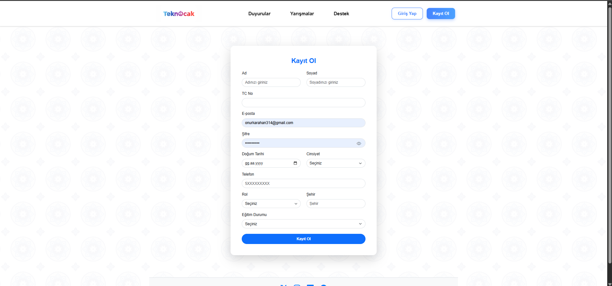

# TeknOcak-Frontend-Rebuild-Project

                                    --Goals--
1- Rebuild ugly font-end design for more accesebilty and optimizations.

2- Create scroll and welcome animations.

3- Create a loading animation site.

                                    --Frontend--
1- Add light and dark modes.

    Techstack:
    -HTML
    -CSS
    -Javascript
-
        Some old front-end design images:

